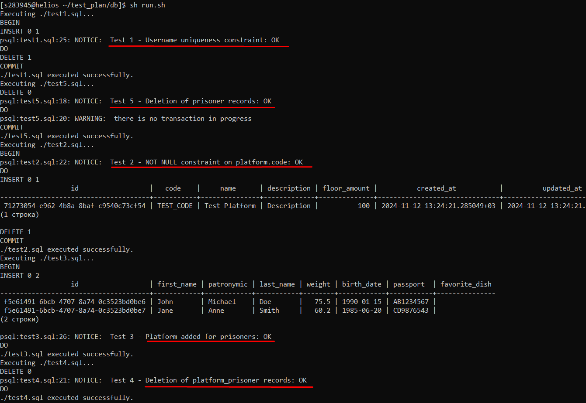
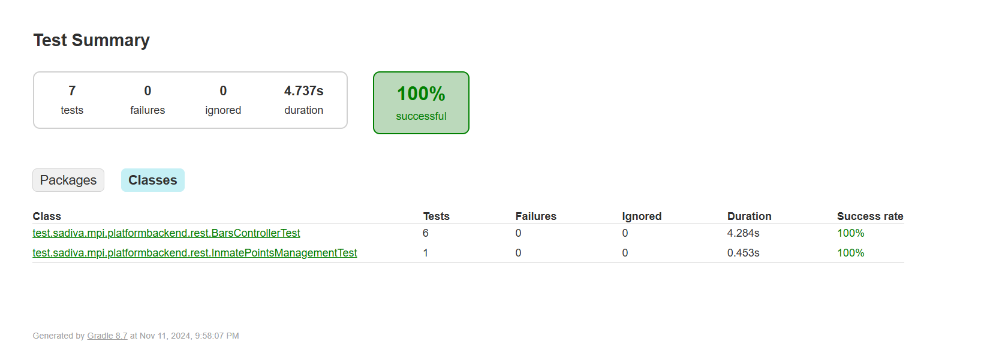

### 1. Тестирование схемы БД


[Исходники](https://github.com/dianainya/Software-engineering-methodology/tree/main/test/sql-scripts)

Пример теста (test1.sql):

```sql

-- Test 1: Проверка уникальности пользователей в platform_user
BEGIN;

INSERT INTO platform_user (username, password, activated)
VALUES ('db_test_user', 'password', true);

DO
$$
    DECLARE
conflict boolean := false;
BEGIN
BEGIN
INSERT INTO platform_user (username, password, activated)
VALUES ('db_test_user', 'password', true);
EXCEPTION
            WHEN unique_violation THEN
                conflict := true;
END;
        IF conflict THEN
            RAISE NOTICE 'Test 1 - Username uniqueness constraint: OK';
ELSE
            RAISE NOTICE 'Test 1 - Username uniqueness constraint: FAILED';
END IF;
END
$$;

DELETE FROM platform_user WHERE username = 'db_test_user';
COMMIT;

```
Скрипт для запуска:

```bash
#!/bin/bash

DIRECTORY="${1:-.}"

find "$DIRECTORY" -type f -name "*.sql" | while read -r file; do
    echo "Executing $file..."
    psql -U s283945 -f "$file"
    if [ $? -ne 0 ]; then
        echo "Error executing $file"
        exit 1
    else
        echo "$file executed successfully."
    fi
done

```

Рузьтаты:


### 2.  Function Testing (Функциональное тестирование)

**Technique Objective:** Обеспечение корректности моделирования бизнес-цикла, сохранение инвариантов, полная и точная реализация требований

**Technique (Описание процесса):**
Использовать для подробностей документы SRS, UC
1. Создать заключенного в системе и залогиниться
2. Пройти основной поток юзкейса InmatePointsManagement 
3. Убедиться, что платформа распределила заключенных согласно рейтингу
   
**Инструменты:** Junit, Mockito, TestContainers

[Исходный код теста REST-котроллера](https://github.com/dianainya/platform-backend/blob/main/src/test/java/test/sadiva/mpi/platformbackend/rest/BarsControllerTest.java)

Фрагмент:
```java
        @Test
        public void whenAddPointsToPrisoner_thenOk() throws Exception {
        //given
        Prisoner prisoner1 = baseUtils.createPrisoner();
        Prisoner prisoner2 = baseUtils.createPrisoner();
        Prisoner prisoner3 = baseUtils.createPrisoner();

        final BarsAddScoreReq req = new BarsAddScoreReq(prisoner1.getId(), 5);

        //when
        mockMvc.perform(MockMvcRequestBuilders.post(BARS_API + ADD_PATH)
                        .content(objectMapper.writeValueAsString(req))
                        .contentType(MediaType.APPLICATION_JSON))
                //then
                .andExpect(status().isNoContent());
        PrisonerRating actualRating1 = getPrisonerRatingById(prisoner1.getId());
        PrisonerRating actualRating2 = getPrisonerRatingById(prisoner2.getId());
        PrisonerRating actualRating3 = getPrisonerRatingById(prisoner3.getId());

        assertEquals(new BigDecimal(105), actualRating1.getScore());
        assertEquals(new BigDecimal(100), actualRating2.getScore());
        assertEquals(new BigDecimal(100), actualRating3.getScore());
    }
```
[Исходный код для UC](https://github.com/dianainya/platform-backend/blob/main/src/test/java/test/sadiva/mpi/platformbackend/e2e/InmatePointsManagementTest.java)

Фрагмент:
```java
    @Test
    public void whenAnalystSubmitsActionForm_thenPrisonerRatingIsUpdated_andAdminCanView() throws Exception {
        // Получение списка нарушений
        final List<ViolationRes> violations = callGetEndpoint(BARS_API + VIOLATIONS_PATH, new TypeReference<>() {
        });

        assertNotNull(violations, "Список нарушений не должен быть пустым");
        assertNotNull(violations.get(0).code(), "Код нарушения должен быть задан");
        assertNotNull(violations.get(0).score(), "Очки нарушения должны быть заданы");

        final ViolationRes violation = violations.get(0);
        final Prisoner prisoner = baseUtils.createPrisoner();

        // Аналитик отправляет форму с нарушением
        BarsSubtractScoreReq violationRequest = new BarsSubtractScoreReq(prisoner.getId(), violation.code());
        callPostEndpoint204(violationRequest, BARS_API + SUBTRACT_PATH);

        // Проверка обновленного рейтинга заключенного
        final PrisonerRes actualPrisoner = callGetEndpoint( PRISONERS_API + "/" + prisoner.getId(), new TypeReference<>() {
        });
        final BigDecimal expectedRating = new BigDecimal(100 - violation.score());

        assertNotNull(actualPrisoner, "Заключенный должен быть доступен.");
        assertEquals(actualPrisoner.rating(), expectedRating);
    }
```
Результаты:


3. Ui тестирование
Technique Objective: Проверка корректного отображения интерфейса регистрации и работы логики выбора блюда, обеспечение соответствия требованиям UX/UI и корректности бизнес-логики.

Technique (Описание процесса):

Использовать для подробностей макеты UX/UI и требования функциональных спецификаций (SRS).
Взаимодействовать с формой регистрации через автоматизированные UI-тесты.
Использовать мок-данные для имитации выборки данных о блюдах.
Шаги выполнения:

Запустить экран регистрации через тестовый фреймворк Compose UI.
Проверить отображение всех обязательных полей на форме.
Заполнить обязательные поля (Фамилия, Имя, Отчество, Паспорт, Дата рождения, Рост, Вес).
Подтвердить корректную активацию кнопки "Подтвердить регистрацию" при валидных данных.
Используя мок-контроллер, подставить тестовые данные о блюде и выбрать его через интерфейс.
Убедиться, что выбор блюда корректно отображается в UI.
Нажать кнопку подтверждения регистрации.
Проверить, что вызов метода registerPrisoner в контроллере выполнен с корректными параметрами.
Критерии приемки:

Поля отображаются и доступны для ввода.
Кнопка "Подтвердить регистрацию" становится активной только при валидных данных.
Выбор блюда отображается корректно в интерфейсе.
Метод регистрации вызывается с ожидаемыми данными.
Инструменты: Junit, Mockito, Compose Test Api


Фрагмент:
```kotlin
class RegistrationScreenTest {

    @get:Rule
    val composeTestRule = createComposeRule()

    private fun createMockDish(): ServDish {
        val mockProduct = ServProduct(
            id = "1",
            name = "Пельмени",
            calories = "200",
            proteins = 10,
            fats = 5,
            carbohydrates = 30,
            weight = 100
        )

        val mockIngredient = ServIngredient(
            amount = 2,
            product = mockProduct
        )

        return ServDish(
            id = "1",
            name = "Пельмени",
            description = "Очень вкусные пельмени",
            receipt = "Просто варите",
            ingredients = listOf(mockIngredient)
        )
    }

    @Test
    fun testRegistrationScreenFieldsAreVisible() = runTest {
        val registrationController = mock<RegistrationController>()
        val mockDish = createMockDish()
        whenever(registrationController.getDishes()).thenReturn((
            DishApiResponse(
                content = listOf(mockDish),
                totalCount = 10,
                page = 1,
                size = 10
            )
        ))


        val di = DI {
            bind<RegistrationController>() with singleton { registrationController }
        }

        composeTestRule.setContent {
            withDI(di) {
                RegistrationScreen()
            }
        }


        composeTestRule.onNodeWithText("Фамилия").assertIsDisplayed()
        composeTestRule.onNodeWithText("Имя").assertIsDisplayed()
        composeTestRule.onNodeWithText("Отчество").assertIsDisplayed()
        composeTestRule.onNodeWithText("Паспорт").assertIsDisplayed()
        composeTestRule.onNodeWithText("Дата рождения").assertIsDisplayed()
        composeTestRule.onNodeWithText("Рост").assertIsDisplayed()
        composeTestRule.onNodeWithText("Вес").assertIsDisplayed()
        composeTestRule.onNodeWithText("Подтвердить регистрацию").assertIsDisplayed()
    }

    @Test
    fun testButtonEnabledWhenAllFieldsAreValid() {

        composeTestRule.setContent {
            RegistrationScreen()
        }


        composeTestRule.onNodeWithText("Фамилия").performTextInput("Иванов")
        composeTestRule.onNodeWithText("Имя").performTextInput("Иван")
        composeTestRule.onNodeWithText("Отчество").performTextInput("Иванович")
        composeTestRule.onNodeWithText("Паспорт").performTextInput("1234567890")
        composeTestRule.onNodeWithText("Дата рождения").performTextInput("01.01.1980")
        composeTestRule.onNodeWithText("Рост").performTextInput("180")
        composeTestRule.onNodeWithText("Вес").performTextInput("75")


        composeTestRule.onNodeWithText("Подтвердить регистрацию").assertIsEnabled()
    }

    @Test
    fun testDishSelection() = runTest {

        val mockDish = createMockDish()


        val registrationController = mock<RegistrationController>()
        whenever(registrationController.getDishes()).thenReturn(listOf(mockDish))

        composeTestRule.setContent {
            RegistrationScreen()
        }


        composeTestRule.onNodeWithText(mockDish.name).assertIsDisplayed()


        composeTestRule.onNodeWithText(mockDish.name).performClick()


        composeTestRule.onNodeWithText(mockDish.name).assertIsDisplayed()
    }

    @Test
    fun testSubmitButtonFunctionality() = runTest {

        val registrationController = mock<RegistrationController>()

        composeTestRule.setContent {
            RegistrationScreen()
        }


        composeTestRule.onNodeWithText("Фамилия").performTextInput("Иванов")
        composeTestRule.onNodeWithText("Имя").performTextInput("Иван")
        composeTestRule.onNodeWithText("Отчество").performTextInput("Иванович")
        composeTestRule.onNodeWithText("Паспорт").performTextInput("1234567890")
        composeTestRule.onNodeWithText("Дата рождения").performTextInput("01.01.1980")
        composeTestRule.onNodeWithText("Рост").performTextInput("180")
        composeTestRule.onNodeWithText("Вес").performTextInput("75")


        val mockDish = createMockDish()
        composeTestRule.onNodeWithText(mockDish.name).performClick()


        composeTestRule.onNodeWithText("Подтвердить регистрацию").performClick()


        verify(registrationController).registerPrisoner(
            RegisterPrisonerModel(
                lastName = "",
                firstName = "",
                patronymic = "",
                passport = "",
                weight = 1,
                birthDate = "String",
                favoriteDish = " String"
            )
        )
    }
}

class FavouriteDishSelectionDropdownMenuTest {
    @get:Rule
    val composeTestRule = createComposeRule()

    @Test
    fun favouriteDishSelectionDropdownMenuTest() = runTest {
        var selectedDish: ServDish? = null
        val testDishes = listOf(
            ServDish(
                id = "1",
                name = "Pizza",
                description = "Delicious pizza",
                receipt = "Pizza recipe",
                ingredients = emptyList()
            )
        )


        composeTestRule.setContent {
            FavouriteDishSelectionDropdownMenu(
                availableDishes = testDishes,
                selectedDish = selectedDish,
                onSelectDish = { selectedDish = it }
            )
        }

        composeTestRule.onNodeWithText("Выберите блюдо").performClick()
        composeTestRule.onNodeWithText("Pizza").performClick()

        assertEquals("Pizza", selectedDish?.name)
    }
}
```

Исходный код: 
```kotlin
@Composable
fun RegistrationScreen() {
    var lastName by remember { mutableStateOf("") }
    var firstName by remember { mutableStateOf("") }
    var patronymic by remember { mutableStateOf("") }
    var height by remember { mutableStateOf("0") }
    var weight by remember { mutableStateOf("0") }
    var birthDate by remember { mutableStateOf("") }
    var pasport by remember { mutableStateOf("") }
    var showIndicator by remember { mutableStateOf(false) }
    val scope = rememberCoroutineScope()

    var availableDishes by remember { mutableStateOf<List<ServDish>>(emptyList()) }

    var selectedDish by remember { mutableStateOf<ServDish?>(null) }
    val registrationController: RegistrationController by localDI().instance()
    LaunchedEffect(true) {
        fetchDishesFromServer(registrationController) { dish ->
            availableDishes = dish
        }
        fetchPrisonersFromServer(registrationController){ prisonerModels ->
            println(prisonerModels)
        }
    }

    Box(Modifier.fillMaxSize(), contentAlignment = Alignment.Center) {
        Column(Modifier.width(450.dp)) {
            Row(Modifier.align(Alignment.CenterHorizontally)) {
                Text(
                    text = "Регистрация нового заключенного",
                    fontWeight = FontWeight.Bold,
                    fontSize = 18.sp,
                    textAlign = TextAlign.Center,
                )
            }
            Row(Modifier.align(Alignment.CenterHorizontally)) {
                Text(
                    text = "Заполните все поля для регистрации",
                    fontSize = 16.sp,
                    textAlign = TextAlign.End,
                )
            }
            Spacer(Modifier.height(60.dp).fillMaxWidth())
            OutlinedTextField(
                value = lastName,
                onValueChange = {
                    lastName = it
                },
                textStyle = TextStyle(
                    fontSize = 16.sp
                ),
                label = {
                    Text("Фамилия", color = Color.LightGray)
                },
                singleLine = true,
                shape = RoundedCornerShape(12.dp),
                modifier = Modifier.fillMaxWidth()
            )
            Spacer(Modifier.height(20.dp).fillMaxWidth())
            OutlinedTextField(
                value = firstName,
                onValueChange = {
                    firstName = it
                },
                textStyle = TextStyle(
                    fontSize = 16.sp
                ),
                label = {
                    Text("Имя", color = Color.LightGray)
                },
                singleLine = true,
                shape = RoundedCornerShape(12.dp),
                modifier = Modifier.fillMaxWidth()
            )
            Spacer(Modifier.height(20.dp).fillMaxWidth())
            OutlinedTextField(
                value = patronymic,
                onValueChange = {
                    patronymic = it
                },
                textStyle = TextStyle(
                    fontSize = 16.sp
                ),
                label = {
                    Text("Отчество", color = Color.LightGray)
                },
                singleLine = true,
                shape = RoundedCornerShape(12.dp),
                modifier = Modifier.fillMaxWidth()
            )
            Spacer(Modifier.height(20.dp).fillMaxWidth())
            OutlinedTextField(
                value = pasport,
                onValueChange = {
                    pasport = it
                },
                textStyle = TextStyle(
                    fontSize = 16.sp
                ),
                label = {
                    Text("Паспорт", color = Color.LightGray)
                },
                singleLine = true,
                shape = RoundedCornerShape(12.dp),
                modifier = Modifier.fillMaxWidth()
            )
            Spacer(Modifier.height(20.dp).fillMaxWidth())
            OutlinedTextField(
                value = birthDate,
                onValueChange = {
                    birthDate = it
                },
                textStyle = TextStyle(
                    fontSize = 16.sp
                ),
                label = {
                    Text("Дата рождения", color = Color.LightGray)
                },
                singleLine = true,
                shape = RoundedCornerShape(12.dp),
                modifier = Modifier.fillMaxWidth()
            )
            Spacer(Modifier.height(20.dp).fillMaxWidth())
            Row {
                OutlinedTextField(
                    value = height,
                    onValueChange = {
                        height = it
                    },
                    textStyle = TextStyle(
                        fontSize = 16.sp
                    ),
                    label = {
                        Text("Рост", color = Color.LightGray)
                    },
                    singleLine = true,
                    shape = RoundedCornerShape(12.dp),
                    modifier = Modifier.weight(1f)
                )
                Spacer(Modifier.width(20.dp))
                OutlinedTextField(
                    value = weight,
                    onValueChange = {
                        weight = it
                    },
                    textStyle = TextStyle(
                        fontSize = 16.sp
                    ),
                    label = {
                        Text("Вес", color = Color.LightGray)
                    },
                    singleLine = true,
                    shape = RoundedCornerShape(12.dp),
                    modifier = Modifier.weight(1f)
                )
            }
            Spacer(Modifier.height(20.dp))
            FavouriteDishSelectionDropdownMenu(
                availableDishes = availableDishes,
                onSelectDish = {
                    selectedDish = it
                },
                selectedDish = selectedDish
            )
            Spacer(Modifier.height(60.dp).fillMaxWidth())
            Button(
                onClick = {
                    scope.launch {
                        showIndicator = true
                        val prisonersModel =  RegisterPrisonerModel(
                            lastName = lastName,
                            firstName = firstName,
                            patronymic = patronymic,
                            passport = pasport,
                            weight = weight.toInt(),
                            birthDate = birthDate,
                            favoriteDish = selectedDish!!.id
                        )
                        println( registrationController.registerPrisoner(
                            prisonersModel
                        ))
                        delay(500)
                        showIndicator = false
                    }
                },
                enabled = selectedDish != null && firstName.isNotBlank() && lastName.isNotBlank() && pasport.isNotBlank() && birthDate.isNotBlank(),
                content = {
                    Box(modifier = Modifier.fillMaxWidth(), contentAlignment = Alignment.Center) {
                        if (showIndicator)
                            Indicator(
                                size = 36.dp,
                                onCancelClick = {}
                            )
                        else
                            Text(
                                text = "Подтвердить регистрацию",
                                textAlign = TextAlign.Center
                            )
                    }
                },
                shape = RoundedCornerShape(12.dp),
                modifier = Modifier
                    .height(60.dp)
                    .pointerHoverIcon(PointerIcon.Hand)
            )
        }
    }
}
```
