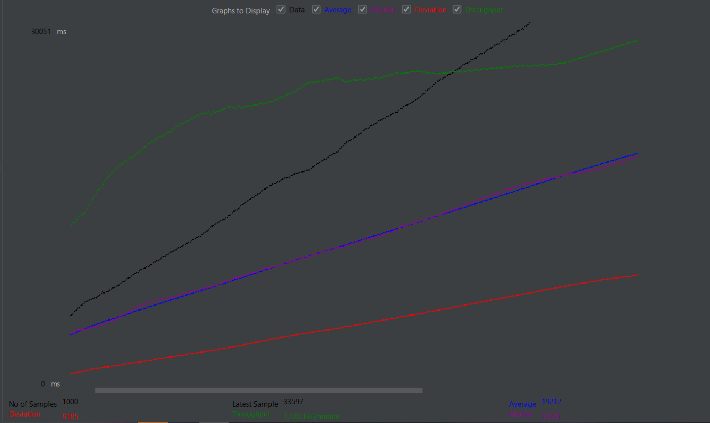

### 2.  Function Testing (Функциональное тестирование)

**Technique Objective:** Обеспечение корректности моделирования бизнес-цикла, сохранение инвариантов, полная и точная реализация требований

**Technique (Описание процесса):**
Использовать для подробностей документы SRS UC
1. Создать заключенного в системе и залогиниться
2. Пройти основной поток юзкейса InmatePointsManagement 
3. Убедиться, что платформа распределила заключенных согласно рейтингу
   
**Инструменты:** Junit, Mockito, TestContainers

[Исходный код теста REST-котроллера](https://github.com/dianainya/platform-backend/blob/main/src/test/java/test/sadiva/mpi/platformbackend/rest/BarsControllerTest.java)

Фрагмент:
```java
        @Test
        public void whenAddPointsToPrisoner_thenOk() throws Exception {
        //given
        Prisoner prisoner1 = baseUtils.createPrisoner();
        Prisoner prisoner2 = baseUtils.createPrisoner();
        Prisoner prisoner3 = baseUtils.createPrisoner();

        final BarsAddScoreReq req = new BarsAddScoreReq(prisoner1.getId(), 5);

        //when
        mockMvc.perform(MockMvcRequestBuilders.post(BARS_API + ADD_PATH)
                        .content(objectMapper.writeValueAsString(req))
                        .contentType(MediaType.APPLICATION_JSON))
                //then
                .andExpect(status().isNoContent());
        PrisonerRating actualRating1 = getPrisonerRatingById(prisoner1.getId());
        PrisonerRating actualRating2 = getPrisonerRatingById(prisoner2.getId());
        PrisonerRating actualRating3 = getPrisonerRatingById(prisoner3.getId());

        assertEquals(new BigDecimal(105), actualRating1.getScore());
        assertEquals(new BigDecimal(100), actualRating2.getScore());
        assertEquals(new BigDecimal(100), actualRating3.getScore());
    }
```
[Исходный код для UC](https://github.com/dianainya/platform-backend/blob/main/src/test/java/test/sadiva/mpi/platformbackend/e2e/InmatePointsManagementTest.java)

Фрагмент:
```java
    @Test
    public void whenAnalystSubmitsActionForm_thenPrisonerRatingIsUpdated_andAdminCanView() throws Exception {
        // Получение списка нарушений
        final List<ViolationRes> violations = callGetEndpoint(BARS_API + VIOLATIONS_PATH, new TypeReference<>() {
        });

        assertNotNull(violations, "Список нарушений не должен быть пустым");
        assertNotNull(violations.get(0).code(), "Код нарушения должен быть задан");
        assertNotNull(violations.get(0).score(), "Очки нарушения должны быть заданы");

        final ViolationRes violation = violations.get(0);
        final Prisoner prisoner = baseUtils.createPrisoner();

        // Аналитик отправляет форму с нарушением
        BarsSubtractScoreReq violationRequest = new BarsSubtractScoreReq(prisoner.getId(), violation.code());
        callPostEndpoint204(violationRequest, BARS_API + SUBTRACT_PATH);

        // Проверка обновленного рейтинга заключенного
        final PrisonerRes actualPrisoner = callGetEndpoint( PRISONERS_API + "/" + prisoner.getId(), new TypeReference<>() {
        });
        final BigDecimal expectedRating = new BigDecimal(100 - violation.score());

        assertNotNull(actualPrisoner, "Заключенный должен быть доступен.");
        assertEquals(actualPrisoner.rating(), expectedRating);
    }
```
Результаты:
