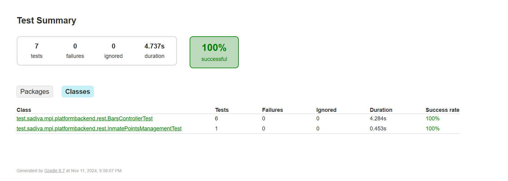

# Матрица тестов для различных типов тестирования

## 1. Тестирование схемы БД (Database Schema Testing)

**Цель:** Проверка корректности работы с базой данных, включая проверку уникальности, целостности данных и соблюдения
ограничений.

| **Тест**                                                                        | **Описание**                                                                                     | **Инструменты**  | **Ожидаемый результат**                                                           | **Исходники**                                                                                                    |
|---------------------------------------------------------------------------------|--------------------------------------------------------------------------------------------------|------------------|-----------------------------------------------------------------------------------|------------------------------------------------------------------------------------------------------------------|
| **Тест 1: Проверка уникальности пользователей в `platform_user`**               | Проверка уникальности `username` в таблице `platform_user`.                                      | PostgreSQL, Bash | Ошибка при попытке вставить пользователя с уже существующим `username`.           | [sql скрипт](https://github.com/dianainya/Software-engineering-methodology/tree/main/test/sql-scripts/test1.sql) |
| **Тест 2: Проверка ограничения NOT NULL для поля `username` в `platform_user`** | Попытка вставить пользователя с NULL значением в поле `username`.                                | PostgreSQL, Bash | Ошибка из-за нарушения ограничения NOT NULL.                                      | [sql скрипт](https://github.com/dianainya/Software-engineering-methodology/tree/main/test/sql-scripts/test2.sql) |
| **Тест 3: Проверка внешнего ключа на таблицу `prisoner`**                       | Проверка корректности связи между таблицами с использованием внешнего ключа.                     | PostgreSQL, Bash | Ошибка при вставке строки с несоответствующим значением внешнего ключа.           | [sql скрипт](https://github.com/dianainya/Software-engineering-methodology/tree/main/test/sql-scripts/test3.sql) |
| **Тест 4: Удаление данных из `platform_prisoner`**                              | Проверка правильности удаления данных из таблицы `platform_prisoner` после удаления заключенных. | PostgreSQL, Bash | Данные из таблицы `platform_prisoner` удаляются корректно, связанных записей нет. | [sql скрипт](https://github.com/dianainya/Software-engineering-methodology/tree/main/test/sql-scripts/test4.sql) |
| **Тест 5: Проверка, что записи заключенных удалены корректно**                  | Проверка корректности удаления записей заключенных из таблицы `prisoner`.                        | PostgreSQL, Bash | Записи заключенных успешно удалены из таблицы `prisoner`.                         | [sql скрипт](https://github.com/dianainya/Software-engineering-methodology/tree/main/test/sql-scripts/test5.sql) |

Рузьтаты:

## 2. Функциональное тестирование (Function Testing)

**Цель:** Проверка правильности реализации бизнес-логики и сценариев использования, в том числе корректности обработки
данных, инвариантов и требований.

| **Тест**                                      | **Описание**                                                           | **Инструменты**                | **Ожидаемый результат**                                                                  | **Исходники**                                                                                                                                   |
|-----------------------------------------------|------------------------------------------------------------------------|--------------------------------|------------------------------------------------------------------------------------------|-------------------------------------------------------------------------------------------------------------------------------------------------|
| **Тест 1: Проверка добавления заключенного**  | Проверка добавления заключенного через UI.                             | JUnit, Mockito, TestContainers | Очки добавлены корректно, рейтинг заключенного обновляется.                              | [Тест](https://github.com/dianainya/platform-backend/blob/main/src/test/java/test/sadiva/mpi/platformbackend/rest/BarsControllerTest.java#L76)  |
| **Тест 2: Проверка поиска заключенного**      | Проверка поиска заключенного через UI                                  | JUnit, Mockito, TestContainers | Заключенный найден по поисковому запросу, отображаются правильные данные.                | [Тест](https://github.com/dianainya/platform-backend/blob/main/src/test/java/test/sadiva/mpi/platformbackend/rest/BarsControllerTest.java#L100) |
| **Тест 3: Проверка валидации формы создания** | Проверка корректности работы валидации на форме создания заключенного. | JUnit, Mockito, TestContainers | Форма не отправляется с некорректными данными (например, отсутствие обязательных полей). | [Тест](https://github.com/dianainya/platform-backend/blob/main/src/test/java/test/sadiva/mpi/platformbackend/rest/BarsControllerTest.java#L120) |

Результаты:

## 3. Нагрузочное и стрессовое тестирование (Load Testing & Stress Testing)

**Цель:** Проверка поведения системы при увеличении нагрузки и в стрессовых ситуациях, чтобы понять пределы
производительности.

| **Тест**                                                      | **Описание**                                                                                           | **Инструменты** | **Ожидаемый результат**                                         | **Пример конфигурации**                                                                                                    |
|---------------------------------------------------------------|--------------------------------------------------------------------------------------------------------|-----------------|-----------------------------------------------------------------|----------------------------------------------------------------------------------------------------------------------------|
| **Тест 1: Нагрузочное тестирование API**                      | Проверка работы API при большом количестве параллельных запросов.                                      | JMeter          | Система должна обрабатывать запросы без падений и ошибок.       | [Конфигурация с нагрузкой](https://github.com/dianainya/Software-engineering-methodology/tree/main/test/jmx)               |
| **Тест 2: Стрессовое тестирование с экстремальной нагрузкой** | Проверка системы при максимально возможной нагрузке (например, максимальное количество пользователей). | JMeter          | Система должна справляться с максимальной нагрузкой без ошибок. | [Конфигурация с экстремальной нагрузкой](https://github.com/dianainya/Software-engineering-methodology/tree/main/test/jmx) |

Результаты нагрузочного тестирования:

Результаты стресс тестирования: 

Предел системы 4000-5000 юзеров:

## 4. UI тестирование

**Цель:** Проверка корректности отображения интерфейса и функциональности формы регистрации, а также правильности выбора
блюда.

| **Тест**                           | **Описание**                                                                                                                                                                                                                                                                                                                                      | **Инструменты** | **Ожидаемый результат**            |
|------------------------------------|---------------------------------------------------------------------------------------------------------------------------------------------------------------------------------------------------------------------------------------------------------------------------------------------------------------------------------------------------|-----------------|------------------------------------|
| **Тест: Проверка бизнес процесса** | Проверка следующих UC:  1. Регистрация заключенных под ролью регистратора заключенных  2. Добавление заключенных под ролью повара  3. Добавление баллов заключенному под ролью аналитика заключенных  4. Распределение заключенных по этажам под ролью управляющего платформой  5. Заказ блюд под учетной записью преступника | Selenium, JUnit | Успешно пройденный бизнес процесс. | 

